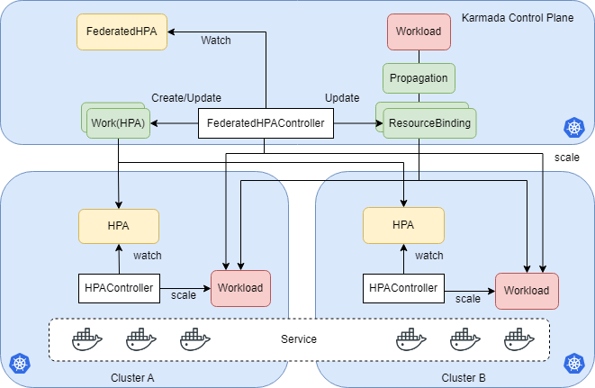

# Federated HPA
## Summary
HPA is a widely used approach to improve the stability of apps dealing with the burst of requests and resource utilization. We can run our apps on multiple clusters as easily as a single cluster with Karmada, but Karmada lacks HPA support now. 
This proposal introduces a new component FederatedHPA to Karmada and enables Karmada to scale workloads across clusters with different policies. It also tries to minimize the user experience differences between HPA in a single cluster and multi-clusters.

## Motivation

<!--
This section is for explicitly listing the motivation, goals, and non-goals of
this KEP.  Describe why the change is important and the benefits to users.
-->

If users deploy the workloads in multi-clusters, they may want to scale the workloads in different clusters with different policies. For example, the workloads in the cluster with high priority may need to be scaled first before the clusters with low priority.

### Goals
1. Bring HPA from single cluster to multi-clusters.
1. Compatible with the HPA-related resources in a single cluster.
1. Tolerate the disaster of member clusters or Karmada control plane.
1. It is better to integrate well with scenarios such as cloud burst.
1. It is better to support both Kubernetes HPA and customized HPA.
1. Minimize control plane overhead when scaling workloads across clusters, and maximize the utilization of member clusters' scaling capabilities. 
1. Having rich scaling policies, users can enable different scenarios with different configurations.
1. Consider cluster-autoscaler, scaling across clusters could be delayed after some period.

### Non-Goals
1. Compatible with the PP/CPP scheduling policy.

## Proposal

<!--
This is where we get down to the specifics of what the proposal is.
This should have enough detail that reviewers can understand exactly what
you're proposing, but should not include things like API designs or
implementation. What is the desired outcome and how do we measure success?
The "Design Details" section below is for the real
nitty-gritty.
-->

### User Stories(Optional)

<!--
Detail the things that people will be able to do if this KEP is implemented.
Include as much detail as possible so that people can understand the "how" of
the system. The goal here is to make this feel real for users without getting
bogged down.
-->

#### Migration HPA from single cluster to multi-clusters with minimal efforts
As a platform developer using Kubernetes, now I want to use Karmada to run apps on multi clusters. But the CD ecosystem is built based on a single cluster and the original HPA is heavily used. So I want to migrate the HPA resources to multi-clusters without too much effort. It is better to be compatible with the schema of HPA used in a single cluster.

#### Scale workloads across multi-clusters
As an application developer, I create an FederatedHPA CR for the application running on Karmada with FederatedHPA enabled.
```
target cpu util 30%
min replica 3
max replica 100
```
Suddenly, one of the member clusters which my application running on can't scale up new pods. Unfortunately, a request burst is coming into the application. The CPU util of pods becomes higher than 30%. It will need 100 Pods totally to take the request burst. I hope the Karmada FederatedHPA can scale up new pods in other healthy clusters with available resource.

#### Scale workloads across multi-clusters with rich policies
As a administrator, I have some clusters in my local data center as well as some clusters in the cloud. I want to scale  up the works in local clusters, if the resource is not enough, then scale up the workloads in the cloud clusters. Besides this, it may include other scenarios, I want Karmada FederatedHPA have rich policies to enable them.

#### Tolerate the failure of Karmada control plane
As an administrator, if the Karmada control plane is down, but there are many applications running on the platform heavily depend on the HPA to handle the unpredictable burst of requests. So I want scaling should still work to a certain extent.

#### Scale workloads across multi-clusters with time delay
As a platform developer, I may install cluster-autoscaler in some clusters, which means it will add nodes into the clusters when the resources is insufficient. If so, scale across multi-clusters is not necessary if cluster-autoscaler works. I want Karmada FederatedHPA could execute scaling across multi-clusters only when cluster-autoscaler doesn't work for specific time.

### Notes/Constraints/Caveats (Optional)

<!--
What are the caveats to the proposal?
What are some important details that didn't come across above?
Go into as much detail as necessary here.
This might be a good place to talk about core concepts and how they relate.
-->

1. The workloads/pods in different member clusters selected by the same HPA CR/resource share the load of the application equally. For example, 10 pods of the application are spread into two member clusters with distribution `cluster1: 3 pods, cluster2: 7 pods`, so the 3 pods in cluster1 take 3/10 of total requests and 7 pods in cluster2 take 7/10 of total requests. Scenarios that don't meet the restriction are not considered in this proposal.

### Risks and Mitigations

<!--
What are the risks of this proposal, and how do we mitigate them? 

How will security be reviewed, and by whom?

How will UX be reviewed, and by whom?

Consider including folks who also work outside the SIG or subproject.
-->

1. This proposal doesn't consider cluster disaster migration for HPA, which should be done in another proposal.
1. When assigning the FederatedHPA, we use availableReplicas as the key factor, it may cause inaccurate HPA assignments.

## Design Details
### Architecture


From the above architecture, FederatedHPA controller should be responsible for the following things:
* Based on the FederatedHPA configuration, assign the minReplicas/maxReplicas of HPA to member clusters by creating works.
* When HPA initial assignment, the controller should update the workload's ResourceBinding based on the assignment results.
* When the member cluster could scale up the workload, FederatedHPA controller should not scale up the workload across clusters, but if the member cluster can not, FederatedHPA controller should scale the workload in other member clusters with different policies.
* If there is a priority policy, the FederatedHPA controller should scale down the low-priority cluster first, if there is no priority policy, the FederatedHPA controller should not care about the scaling down operation.
* The HPA resource version will be `autoscaling/v2`, because the new fields introduced in autoscaling/v2 are preserved as annotations when working with autoscaling/v1. [Referring](https://kubernetes.io/docs/tasks/run-application/horizontal-pod-autoscale/)

To isolate from PP/CPP and avoid PP changes that make it difficult for FederatedHPA to evolve, so we introduce FedertedHPA API to implement the scaling across clusters with rich policies.
```go
type FedertedHAP struct {
    metav1.TypeMeta
    metav1.ObjectMeta

    // Spec defines the desired behavior of federated HPA.
    Spec FederatedHPASpec `json:"spec,omitempty"`

    // Status of the current information about the federated HPA.
    // +optional
    Status FederatedHPAStatus `json:"status,omitempty"`
}

type FederatedHPASpec struct {
    // ScaleTargetRef points to the target resource to scale, and is used to the pods for which metrics
    // should be collected, as well as to actually change the replica count.
    ScaleTargetRef autoscalingv2.CrossVersionObjectReference `json:"scaleTargetRef"`

    // Metrics contains the specifications for which to use to calculate the
    // desired replica count (the maximum replica count across all metrics will
    // be used).  The desired replica count is calculated multiplying the
    // ratio between the target value and the current value by the current
    // number of pods.  Ergo, metrics used must decrease as the pod count is
    // increased, and vice-versa.  See the individual metric source types for
    // more information about how each type of metric must respond.
    // +optional
    Metrics []autoscalingv2.MetricSpec `json:"metrics"`

    // behavior configures the scaling behavior of the target
    // in both Up and Down directions (scaleUp and scaleDown fields respectively).
    // If not set, the default HPAScalingRules for scale up and scale down are used.
    // +optional
    Behavior *autoscalingv2.HorizontalPodAutoscalerBehavior `json:"behavior,omitempty"`

    // ClusterAffinity represents scheduling restrictions to a certain set of clusters.
    // If not set, any cluster can be scheduling candidate.
    // +optional
    ClusterAffinity *policyv1alpha1.ClusterAffinity `json:"clusterAffinity,omitempty"`

    // FederatedMinReplicas is the lower limit for the number of replicas to which the federatedHAP controller
    // can scale down. It defaults to 1 pod and it should not be less than 1.
    // +optional
    FederatedMinReplicas *int32 `json:"federatedMinReplicas,omitempty"`

    // FederatedMaxReplicas is the upper limit for the number of replicas to which the federatedHAP controller
    // can scale up. It cannot be less than FederatedMinReplicas.
    FederatedMaxReplicas *int32 `json:"federatedMaxReplicas"`

    // AutoscaleMultiClusterDelay is the delay for executing autoscaling action in other clusters once
    // the current cluster could not scale the workload. It is used to avoid the situation that cluster-autoscaler is used.
    // +optional
    AutoscaleMultiClusterDelay *int32 `json:"autoscaleMultiClusterDelay,omitempty"`

    // ScalingToZero indicates whether the workload can be scaled to zero in member clusters.
    // +optional
    ScalingToZero bool `json:"scalingToZero,omitempty"`

	// FederatedHPAAssignment is the assignment policy of FederatedMinReplicas/FederatedMaxReplicas
	// +required
    FederatedHPAAssignment FederatedHPAAssignment `json:"federatedHPAAssignment,omitempty"`
}

// FederatedHPAAssignmentType describes assignment methods for FederatedHPA FederatedMinReplicas/FederatedMaxReplicas
type FederatedHPAAssignmentType string

const (
    // FederatedHPAAssignmentTypeDuplicated means when assigning a FederatedHPA,
    // each candidate member cluster will directly apply the original FederatedMinReplicas/FederatedMaxReplicas.
    FederatedHPAAssignmentTypeDuplicated FederatedHPAAssignmentType = "Duplicated"

    // FederatedHPAAssignmentTypeAggregated means when assigning a FederatedHPA,
    // divides FederatedMinReplicas/FederatedMaxReplicas into clusters' HPA as few as possible,
    // while respecting clusters' resource availabilities during the division.
    FederatedHPAAssignmentTypeAggregated FederatedHPAAssignmentType = "Aggregated"

	// FederatedHPAAssignmentTypeStaticWeighted means when assigning a FederatedHPA,
	// divides FederatedMinReplicas/FederatedMaxReplicas into clusters' HPA with static weight.
    FederatedHPAAssignmentTypeStaticWeighted FederatedHPAAssignmentType = "StaticWeighted"

	// FederatedHPAAssignmentTypeDynamicWeighted means when assigning a FederatedHPA,
	// divides FederatedMinReplicas/FederatedMaxReplicas into clusters' HPA with dynamic weight, while clusters' resource availabilities represent the dynamic weight. 
    FederatedHPAAssignmentTypeDynamicWeighted FederatedHPAAssignmentType = "DynamicWeighted"

	// FederatedHPAAssignmentTypeDynamicWeighted means when assigning a FederatedHPA,
	// divides FederatedMinReplicas/FederatedMaxReplicas into clusters' HPA with dynamic weight, while clusters' resource availabilities represent the priority.
    FederatedHPAAssignmentTypePrioritized FederatedHPAAssignmentType = "Prioritized"
)

type FederatedHPAAssignment struct {
	// FederatedHPAAssignmentType determines how FederatedMinReplicas/FederatedMaxReplicas is assigned to member clusters.
	// Valid options are Duplicated, Aggregated, StaticWeighted, DynamicWeighted and Prioritized.
	// +kubebuilder:validation:Enum=Duplicated;Aggregated;StaticWeighted;DynamicWeighted;Prioritized
	// +kubebuilder:default=Duplicated
    FederatedHPAAssignmentType   FederatedHPAAssignmentType           `json:"federatedHPAAssignmentType,omitempty"`
    
	// ClusterAutoscalingPreference describe the priority/static weight for each cluster.
	// If FederatedHPAAssignmentType is set to "StaticWeighted"/"Prioritized"
    // +optional
    ClusterAutoscalingPreference []TargetClusterAutoscalingPreference `json:"clusterAutoscalingPreference,omitempty"`
}

type TargetClusterAutoscalingPreference struct {
	// TargetCluster describes the filter to select clusters.
	// +required
    TargetCluster           *policyv1alpha1.ClusterAffinity    `json:"targetCluster,omitempty"`

    // AutoscalingMaxThreshold is the upper limit for the number of replicas for member clusters, it only works when the FederatedHPAAssignmentType is Aggregated/DynamicWeighted/Prioritized.
    // +optional
    // AutoscalingMaxThreshold int32                              `json:"autoscalingMaxThreshold,omitempty"`

    // AutoscalingMinThreshold is the lower limit for the number of replicas for member clusters, it only works when the FederatedHPAAssignmentType is Aggregated/DynamicWeighted/Prioritized.
    // +optional
    // AutoscalingMinThreshold int32                              `json:"autoscalingMinThreshold,omitempty"`

    // StaticWeight is the weight for the target cluster, it only works when the FederatedHPAAssignmentType is StaticWeighted.
    // +optional
    StaticWeight            *int32                             `json:"staticWeight,omitempty"`
    
    // Priority is the priority for the target cluster, it only works when the FederatedHPAAssignmentType is Prioritized.
    // +optional
    Priority                *int32                             `json:"priority,omitempty"`
}

type FederatedHPAStatus struct {
	// AggregatedStatus contains the assign results and the status of HPA.
    AggregatedStatus []ClusterHPAStatus `json:"aggregatedStatus,omitempty"`
}

type ClusterHPAStatus struct {
    // LastScaleTime is the last time the HorizontalPodAutoscaler scaled the number of pods,
    // used by the autoscaler to control how often the number of pods is changed.
    // +optional
    LastScaleTime *metav1.Time `json:"lastScaleTime,omitempty"`

    // CurrentReplicas is current number of replicas of pods managed by this autoscaler,
    // as last seen by the autoscaler.
    CurrentReplicas int32 `json:"currentReplicas,omitempty"`

    // DesiredReplicas is the desired number of replicas of pods managed by this autoscaler,
    // as last calculated by the autoscaler.
    DesignedReplicas int32 `json:"designedReplicas,omitempty"`

    // CurrentMetrics is the last read state of the metrics used by this autoscaler.
    // +optional
    CurrentMetrics []autoscalingv2.MetricStatus `json:"currentMetrics,omitempty"`

    // Conditions is the set of conditions required for this autoscaler to scale its target,
    // and indicates whether or not those conditions are met.
    Conditions []autoscalingv2.HorizontalPodAutoscalerCondition `json:"conditions,omitempty"`
}

```

### Prerequisites
1. Once the FederatedHPA is applied for the workload, Karmada scheduler should not work for this workload anymore.
1. Once the FederatedHPA is applied for workload, the replicas changes in member clusters should be retained.

### Initialization HPA assignments
When FedertedHPA is applied for the first time or updated, the controller will initialize the HPA assignments to member clusters. The assignments should follow the policy configuration. The following contents describe how to assign the HPA to member clusters with different policies.

#### Duplicated assignment policy
With this policy, FederatedHPA will assign the same minReplicas/maxReplicas(equal to federatedMaxReplicas/federatedMinReplicas) to all member clusters.

So, FederatedHPA controller will create the HPA's works in which the minReplicas/maxReplicas are equal to FederatedMaxReplicas/FederatedMinReplicas in all member clusters.
And also, FederatedHPA controller will update the ResourceBinding to make all the replicas not less than minReplicas.

Suppose we have the following configuration:
```
# FederatedHPA Configuration
ClusterAffinity:
  clusterNames:
    - member1
    - member2
    - member3
    - member5
FederatedHPAMinReplicas: 3
FederatedHPAMaxReplicas: 10
---
# ResourceBinding
clusters:
  - name: member1
    replicas: 1
  - name: member2
    replicas: 4
  - name: member3
    replicas: 20
  - name: member4
    replicas: 5
```

After the assignment, the result will be:
```
# member 1/2/3 HPA
minReplicas: 3
maxReplicas: 10
# ResourceBinding
clusters:
  - name: member1
    replicas: 3
  - name: member2
    replicas: 4 # To avoid overloading, the replicas will not be changed.
  - name: member3
    replicas: 10
  - name: member5
    replicas: 3
```

We can see member4 is deleted from ResourceBinding, which means once the FederatedHPA is applied, the selection result of Karmada scheduler will be ignored.

#### StaticWeighted assignment policy
With this policy, FederatedHPA will assign the minReplicas/maxReplicas to all member clusters based on the static weight configuration.

Suppose we have the following configuration:
```
# FederatedHPA Configuration
ClusterAffinity:
  clusterNames:
    - member1
    - member2
    - member3
FederatedHPAMinReplicas: 2
FederatedHPAMaxReplicas: 10
ScaleToZero: {scaletozero_config}
ClusterAutoscalingPreference:
  - targetCluster:
      clusterNames:
        - member1
    staticWeight: 1
  - targetCluster:
      clusterNames:
        - member2
    staticWeight: 2
  - targetCluster:
      clusterNames:
        - member3
    staticWeight: 3
---
# ResourceBinding
clusters:
  - name: member1
    replicas: 1
  - name: member2
    replicas: 4
```

After the assignment, the result of the HPA assignment will be:
```
#member3 HPA
minReplicas: 1
maxReplicas: 5

#member2 HPA
minReplicas: 1
maxReplicas: 4

#member1 HPA
minReplicas: 1
maxReplicas: 1
```
So if after calculation, the minReplicas is less than 1 but maxReplicas is bigger or equal to 1,  minReplicas should be 1.


If `ScaleToZero` is true, after the assignment, the ResourceBinding will be:
```
# ResourceBinding
clusters:
  - name: member1
    replicas: 1
  - name: member2
    replicas: 4
  - name: member3
    replicas: 0
```


If `ScaleToZero` is false, after the assignment, the result will be:
```
# ResourceBinding
clusters:
  - name: member1
    replicas: 1
  - name: member2
    replicas: 4
  - name: member3
    replicas: 1
```

#### DynamicWeighted assignment policy
With this policy, FederatedHPA will assign the minReplicas/maxReplicas to all member clusters based on the dynamic weight configuration. The dynamic factor only can be availableReplicas.

The initial assignment behavior is similar to the StaticWeighted assignment policy. The only difference is that the dynamic weight is calculated based on the availableReplicas of member clusters.

Suppose we have the following configuration:
```
# FederatedHPA Configuration
ClusterAffinity:
  clusterNames:
    - member1
    - member2
    - member3
FederatedHPAMinReplicas: 8
FederatedHPAMaxReplicas: 24
ScaleToZero: {scaletozero_config}
ClusterAutoscalingPreference:
  hpaAssignmentPolicy: DynamicWeighted
# Cluster availableReplicas
member1: 1
member2: 5
member3: 2
```

After the assignment, the result of the HPA assignment will be:
```
#member 1
minReplicas: 1
maxReplicas: 3
#member 2
minReplicas: 5
maxReplicas: 15
#member 3
minReplicas: 2
maxReplicas: 6
```

The resource binding will be updated after the assignment, same with `StaticWeighted assignment policy`.

#### Aggregated assignment policy
With this policy, FederatedHPA will assign the minReplicas/maxReplicas to all member clusters based on the aggregated status of member clusters.

Suppose we have the following configuration:
```
ClusterAffinity:
  clusterNames:
    - member1
    - member2
    - member3
FederatedHPAMinReplicas: 8
FederatedHPAMaxReplicas: 24
ScaleToZero: {scaletozero_config}
ClusterAutoscalingPreference:
  hpaAssignmentPolicy: Aggregated

# Cluster availableReplicas
member1: 8
member2: 2
member3: 2
```

So after the assignment, the result of the HPA assignment will be:
```
#member 1
minReplicas: 8
maxReplicas: 18 #8+10, after first assignment cycle, 10 replicas is left.
#member 2
minReplicas: 1
maxReplicas: 2
#member 3
minReplicas: 1
maxReplicas: 2
```

The resource binding will be updated after the assignment, same with `StaticWeighted assignment policy`.


#### Prioritized assignment policy
With this policy, FederatedHPA will assign the minReplicas/maxReplicas to all member clusters based on the priority configuration.

Suppose we have the following configuration:
```
#FederatedHPA Configuration
ClusterAffinity:
  clusterNames:
    - member1
    - member2
    - member3
FederatedHPAMinReplicas: 8
FederatedHPAMaxReplicas: 24
ScaleToZero: {scaletozero_config}
ClusterAutoscalingPreference:
  hpaAssignmentPolicy: Prioritized
  hpaAssignmentPolicyConfiguration:
    targetCluster:
      - clusterNames:
          - member1
        priority: 2
      - clusterNames:
          - member2
        priority: 1
#Cluster availableReplicas
member1: 20
member2: 1
#ResourceBinding
clusters:
  - name: member1
    replicas: 15
```

So after the assignment, the result of the HPA assignment will be:
```
#member 1
minReplicas: 8
maxReplicas: 20
#member 2
minReplicas: 1
maxReplicas: 4
```

And if the sum of availableReplicas is smaller than FederatedHPAMaxReplicas, the left will be assigned to the cluster with the highest priority.

The resource binding will be updated after the assignment, same with `StaticWeighted assignment policy`.


### Autoscaling across clusters
With this design architecture, the behavior of scaling across cluster containers has two parts: Scaling Up/Scaling down.
And also, to make the FederatedHPA controller scaling work(no conflicting), FederatedHPA controller only can scale up the workload in member clusters.

#### Duplicated assignment policy
##### Scaling up
FederatedHPA controller should list&watch the status of member HPA, when one member cluster could not scale up the workload(HPA status will show), the FederatedHPA controller will scale up the workload in other member clusters(the one with the most available replicas).

The number of replicas that need to be scaled up in different clusters will be calculated from the member cluster's HPA status(metrics or pending pods exists)

##### Scaling down
FederatedHPA controller should not care about this.

#### StaticWeighted assignment policy
##### Scaling up
Similar to `Duplicated assignment policy`, but FederatedHPA controller will scale up the replicas in member clusters based on the static weight.

For example, there is the following cluster's status:
```
targetUtilization: 50%
cluster 1 static weight: 1
cluster 2 static weight: 3
cluster 3 static weight: 1

cluster 1:
  current replicas: 4
  maxReplicas: 4
  current Utilization: 100

cluster 2:
  current replicas: 8
  maxReplicas: 100
  current Utilization: 50

cluster 3:
  current replicas: 8
  maxReplicas: 100
  current Utilization: 50

```

So, FederatedHPA controller will directly scale 3 replicas up in cluster 2, and 1 replica in cluster 3(If there are pending pods, the behavior will be the same).

##### Scaling down
FederatedHPA controller should not care about this.

#### DynamicWeighted assignment policy
##### Scaling up
Similar to `StaticWeighted assignment policy`, but FederatedHPA controller will scale up the replicas in member clusters based on the dynamic weight(availableReplicas).

For example, there is the following cluster's status:
```
targetUtilization: 50%

cluster 1:
  current replicas: 4
  maxReplicas: 4
  current Utilization: 100

cluster 2:
  current replicas: 8
  maxReplicas: 100
  current Utilization: 50
  currentAvailableReplicas: 50

cluster 3:
  current replicas: 8
  maxReplicas: 100
  current Utilization: 50
  currentAvailableReplicas: 50

```

So, FederatedHPA controller will directly scale 2 replicas up in cluster 2, and 2 replicas in cluster 3(If there are pending pods, the behavior will be the same).

##### Scaling down
FederatedHPA controller should not care about this.

#### Aggregated assignment policy
##### Scaling up
Similar to `StaticWeighted assignment policy`, but FederatedHPA controller will scale up the replicas in member clusters based on aggregated policy.

For example, there is the following cluster's status:
```
targetUtilization: 50%

cluster 1:
  current replicas: 4
  maxReplicas: 4
  current Utilization: 100

cluster 2:
  current replicas: 9
  maxReplicas: 100
  current Utilization: 50
  currentAvailableReplicas: 3

cluster 3:
  current replicas: 3
  maxReplicas: 100
  current Utilization: 50
  currentAvailableReplicas: 1

```

So, FederatedHPA controller will directly scale 3 replicas up in cluster 2, and 1 replica in cluster 3(If there are pending pods, the behavior will be the same).

##### Scaling down
FederatedHPA controller should not care about this.

#### Prioritized assignment policy
##### Scaling up
Similar to `StaticWeighted assignment policy`, but FederatedHPA controller will scale up the replicas in member clusters based on priority order.

For example, there is the following cluster's status:
```
targetUtilization: 50%

cluster 1:
  current replicas: 4
  maxReplicas: 4
  current Utilization: 100
  priority: 1

cluster 2:
  current replicas: 9
  maxReplicas: 100
  current Utilization: 50
  currentAvailableReplicas: 3
  priority: 2

cluster 3:
  current replicas: 3
  maxReplicas: 100
  current Utilization: 50
  currentAvailableReplicas: 1
  priority: 1

```

So, FederatedHPA controller will directly scale 3 replicas up in cluster 2, and 1 replica in cluster 3(If there are pending pods, the behavior will be the same).

##### Scaling down
In general, if one cluster is scaling down, all the member clusters are scaling down the same workload. FederatedHPA controller should update the high-priority cluster's scale resource with the same replicas, but let the low priority cluster's HPA controller scale the replicas down first.

For example, there is the following cluster's status:
```
targetUtilization: 50%

cluster 1:
  current replicas: 4
  maxReplicas: 4
  current Utilization: 25
  priority: 3
  minReplicas: 1

cluster 2:
  current replicas: 9
  maxReplicas: 100
  current Utilization: 25
  currentAvailableReplicas: 3
  priority: 2
  minReplicas: 1

cluster 3:
  current replicas: 4
  maxReplicas: 100
  current Utilization: 25
  currentAvailableReplicas: 1
  priority: 1
  minReplicas: 1
```

So the steps will be:
* FederatedHPA controller should update cluster-2/cluster-3's scale resource with 4/9 replicas, and cluster-3's HPA controller will scale the replicas to 2.
* After cluster-3's replicas are equal to 1, FederatedHPA controller will only update cluster-1's scale resource, and let cluster-2's HPA controller works normally.

### Optimization of HPA in member clusters
The resource state of member clusters is changed with time, so we should optimize the HPA minReplicas/maxReplicas, to implement:
* Fewer works for FederatedHPA controller: If the HPA minReplicas/maxReplicas is not suitable for member clusters' state, FederatedHPA controller will always do scaling across clusters by triggers.
* Better to tolerate Karmada control plane disaster: If Karmada control plane is down, the member clusters' HPA controller could scale the workload better and the resource will have a bigger utilization.

PS: This only works for Aggregated/DynamicWeighted/Prioritized policy.

#### Period optimization
So the key optimization way is:
1. Update all the member clusters' maxReplicas to the current workload replicas.
1. Sum all clusters (maxReplicas - current replicas).
1. Reassign the sum to all member cluster's maxReplicas based on the policy.

For example, the StaticWeighted policy is used:
```
#cluster 1
staticWeight: 2
current replica: 6
maxReplicas: 7
#cluster 2
staticWeight: 1
current replica: 6
maxReplicas: 8
#cluster 3
staticWeight: 1
current replica: 6
maxReplicas: 7
```

The sum is (7-6)+(8-6)+(7-6)=4, so the new HPA of clusters should be:
```
#cluster 1
staticWeight: 2
current replica: 6
maxReplicas: 8
#cluster 2
staticWeight: 1
current replica: 6
maxReplicas: 7
#cluster 3
staticWeight: 1
current replica: 6
maxReplicas: 7
```

About minReplicas, the optimization condition is: when the workload replicas are zero, It will reassign this cluster HPA to all existing clusters(including itself).

#### Trigger optimization
When there are clusters that could not scale the workloads up(pending), FederatedHPA controller should reassign (maxReplicas - not pending replicas) to other clusters' HPA maxReplicas, and also change the HPA maxReplicas to the current replicas.

### Scaling from/to zero
This behavior only exists when `ScaleToZero` is true.

#### Scaling to zero
After initial assignments and scaling operation, the replicas in the member cluster are all equal to HPA minReplicas, but the sum of minReplicas is larger than FederatedMinReplicas and the utilization is smaller than the target. For this scenario, FederatedHPA controller should scale some clusters' replicas to 0.

So the key point is how to select the target clusters:
* Duplicated policy: FederatedHPA controller shouldn't do anything.
* Aggregated policy: Select the one with the smallest replicas.
* StaticWeighted policy: Select the one with the smallest static weight.
* DynamicWeighted policy: Select the one with the smallest dynamic weight.
* Prioritized policy: Select the one with the smallest priority.

#### Scaling from zero
After step `Scaling to zero`, when meeting the scaling operation, FederatedHPA controller should scale the clusters with zero replicas.

So the key point is how to select the target clusters:
* Duplicated policy: FederatedHPA controller shouldn't do anything.
* Aggregated policy: Select all the clusters with zero replicas.
* StaticWeighted policy: Select all the clusters with zero replicas.
* DynamicWeighted policy: Select all the clusters with zero replicas.
* Prioritized policy: Select the one with the lowest priority.


### High Availability
With the scaling operation in different layers(member clusters and Karmada control plane), scaling across clusters is highly available. When member clusters could scale the workloads by themselves, Karmada control plane will not help to scale the workloads across multi-cluster. When member clusters could not scale the workloads(pending pods or other), Karmada control plane will help to scale the workloads in other member clusters.
So When Karmada control plane is down, the HPA controller(K8s native) should still work in the member clusters, and it just loses the capability to scale the workloads in other clusters.

## Development Plan
This feature is quite huge, so we will implement it in four stages:
1. Implement the API definition and initial HPA assignment to member clusters with duplicated and static weighted policy.
1. Implement initial HPA assignment for dynamic weighted policy, aggregated policy, and prioritized policy.
1. Implement autoscaling across clusters with different policies with scaling up/down.
1. Implement the optimization of HPA in member clusters after assigning different policies.
1. Implement scaling to/from zero with different policies in member clusters.
1. AutoscalingMaxThreshold/AutoscalingMinThreshold is quite complex, give another proposal in the future.

## Test Plan

1. All current testing should be passed, no break change would be involved by this feature.
1. Add new E2E test cases to cover the new feature.
   1. Initial HPA assignment to member clusters with different policies.
   1. Scaling across clusters with different policies with scaling up/down.
   1. Optimize the HPA in member clusters after assigning different policies.
   1. Scaling to/from zero with different policies in member clusters.


## Alternatives
Enhancing the ability of PP is an alternative. But as mentioned before, this approach will make things complex:
* It will take a lot of effort to enhance PP's ability.
* Both PP and HPA are difficult to evolve because both need to consider their impact on each other.
